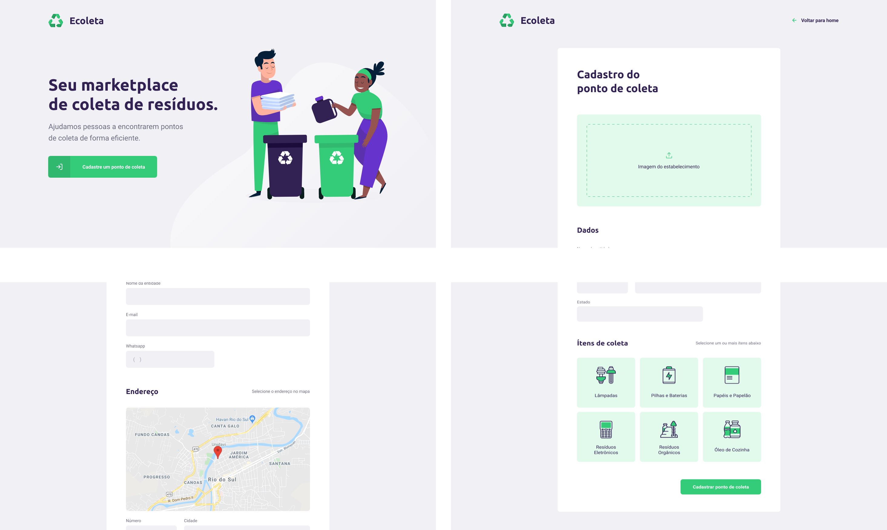
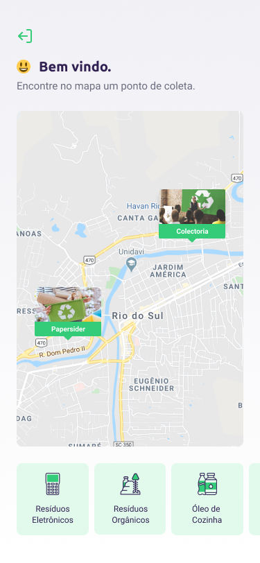

# Ecoleta
 
<h4 align="center">
Preserve o meio ambiente, Recicle !
</h4>

<p align="center">
  

  

  	
  <a href="https://www.twitter.com/tgmarinho/">
    
  </a>
	
  
  <a href="https://github.com/tgmarinho/nlw1/commits/master">
    
  </a>

  
   <a href="https://github.com/tgmarinho/nlw1/stargazers">
    
  </a>
</p>

--
<h5 align="center">
screenshots da aplicação
</h5>
Web
 

Mobile
 

### Sobre
O **Ecoleta** é uma aplicação Web e Mobile que visa ajudar pessoas a encontrarem pontos de coleta para reciclagem.

O projeto foi desenvolvido durante a **Next Level Week** organizado pela Rocketseat. O NLW é uma experiência online com muito conteúdo prático, desafios e hacks onde o conteúdo fica disponível durante uma semana.

### Tecnologias utilizadas
- [Expo][expo]
- [Node.js][nodejs]
- [React][reactjs]
- [React Native][rn]
- [TypeScript][typescript]

### Instalando a API 

```bash
# Clone este repositório
$ git clone https://github.com/victortmoura/nlw-ecoleta

# Acesse a pasta do projeto no seu terminal/cmd
$ cd nlw-ecoleta/server

# Instale as dependências
$ npm install

# Execute as Migrates
$ npm knex:migrate

# Execute as Seeds
$ npm knex:seed

# Start no server
$ npm dev

# running on port 3333
```

### Rodando o servidor

```bash
# Clone este repositório
$ git clone https://github.com/victortmoura/nlw-ecoleta

# Acesse a pasta do projeto no terminal/cmd
$ cd nlw-ecoleta

# Vá para a pasta server
$ cd server

# Instale as dependências
$ npm install

# Execute a aplicação em modo de desenvolvimento
$ npm run dev

# O servidor inciará na porta:3333 - acesse http://localhost:3333 
```

### Rodando a aplicação web

```bash
# Clone este repositório
$ git clone https://github.com/victortmoura/nlw-ecoleta

# Acesse a pasta do projeto no seu terminal/cmd
$ cd nlw-ecoleta

# Vá para a pasta da aplicação Front End
$ cd web

# Instale as dependências
$ npm install

# Execute a aplicação em modo de desenvolvimento
$ npm run start

# A aplicação será aberta na porta:3000 - acesse http://localhost:3000
```

## 😯 Como contribuir para o projeto

1. Faça um **fork** do projeto.
2. Crie uma nova branch com as suas alterações: `git checkout -b my-feature`
3. Salve as alterações e crie uma mensagem de commit contando o que você fez: `git commit -m "feature: My new feature"`
4. Envie as suas alterações: `git push origin my-feature`
> Caso tenha alguma dúvida confira este [guia de como contribuir no GitHub](https://github.com/firstcontributions/first-contributions)


## 📝 Licença

Este projeto esta sobe a licença MIT.

Feito com ❤️ por Victor Moura 👋🏽 [Entre em contato!](https://www.linkedin.com/in/victorttmoura/)

[nodejs]: https://nodejs.org/
[typescript]: https://www.typescriptlang.org/
[expo]: https://expo.io/
[reactjs]: https://reactjs.org
[rn]: https://facebook.github.io/react-native/
